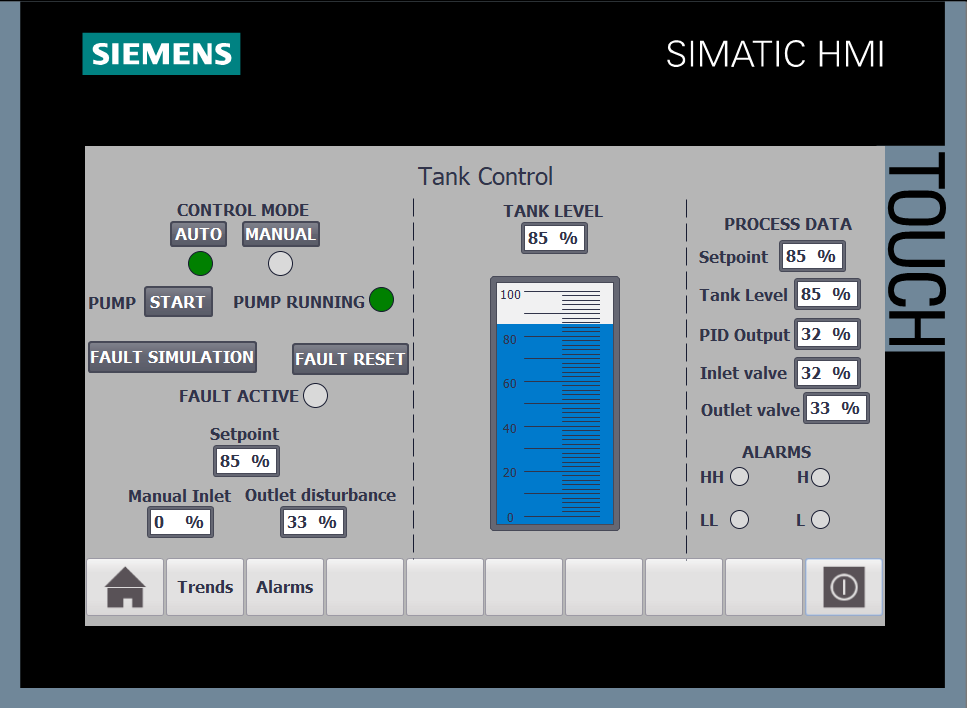
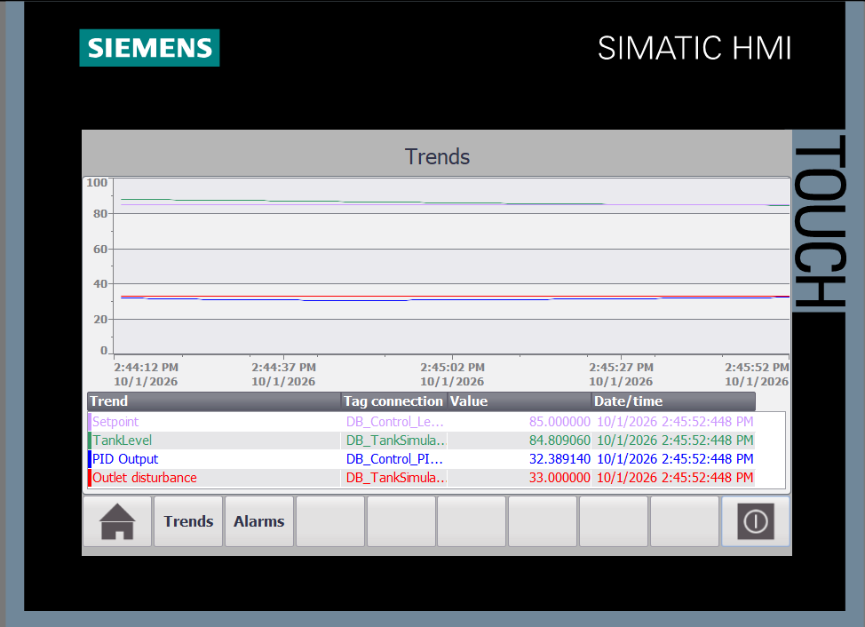
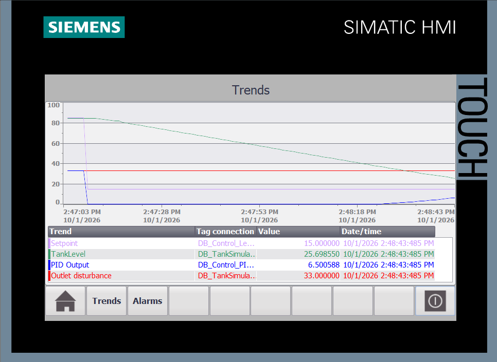
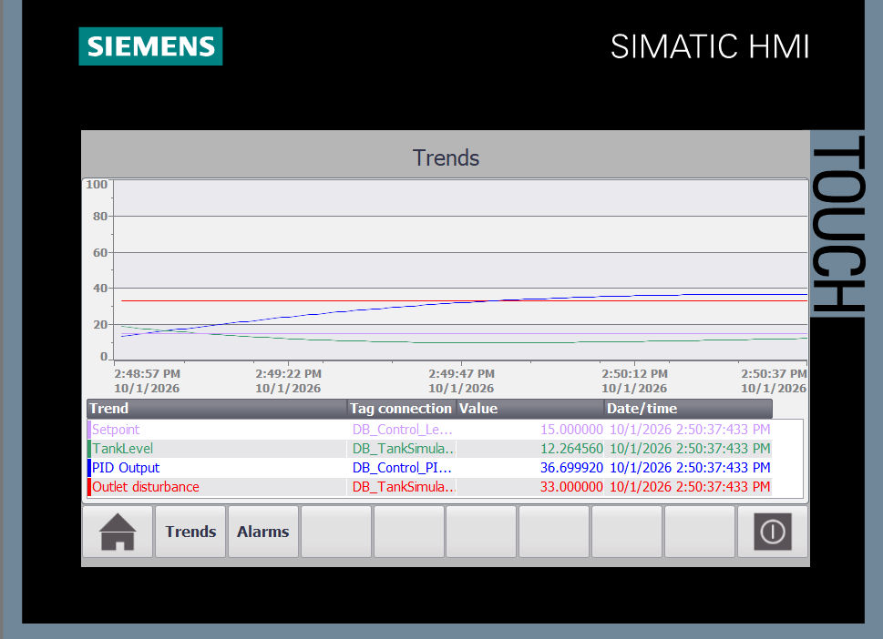
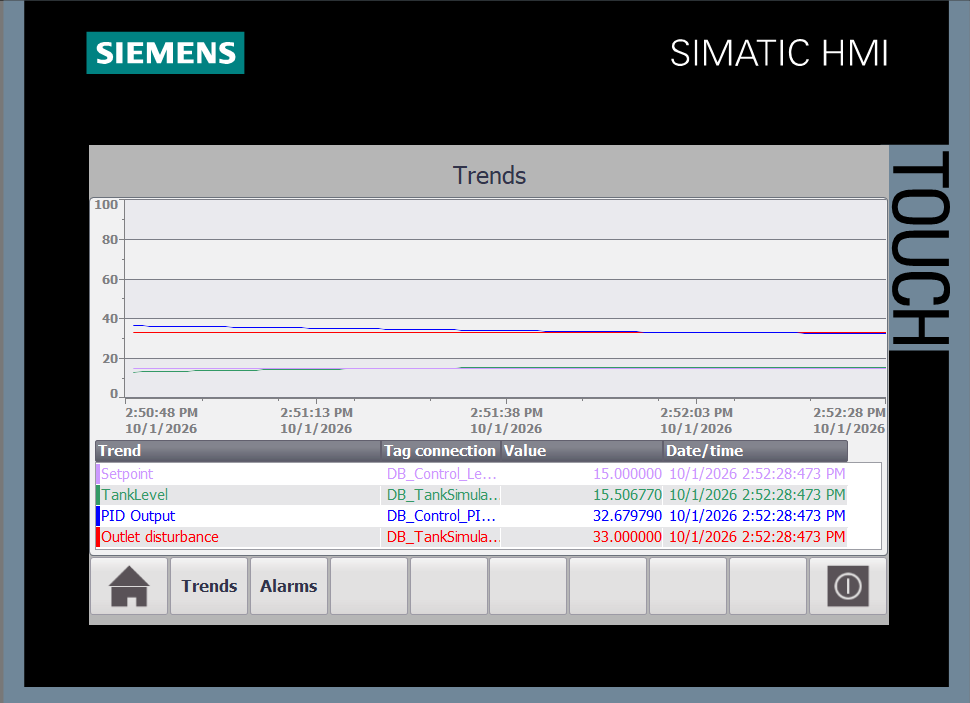
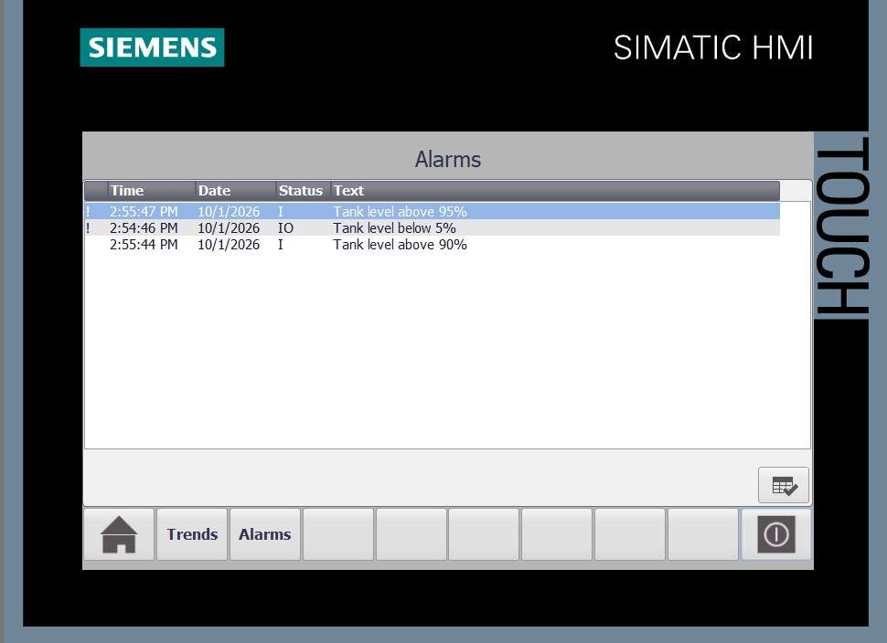
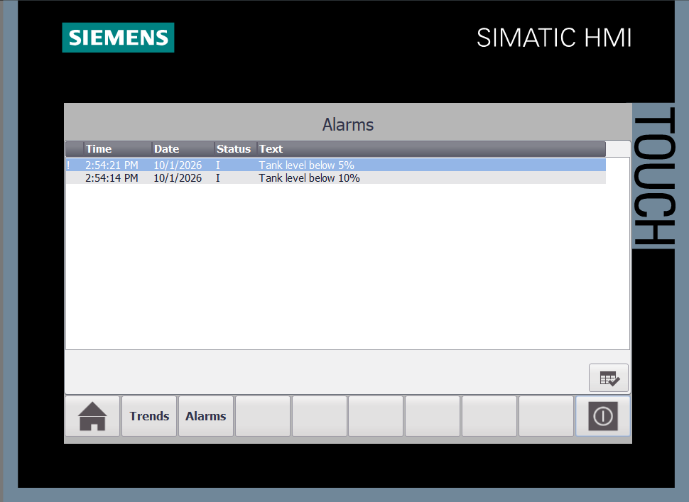
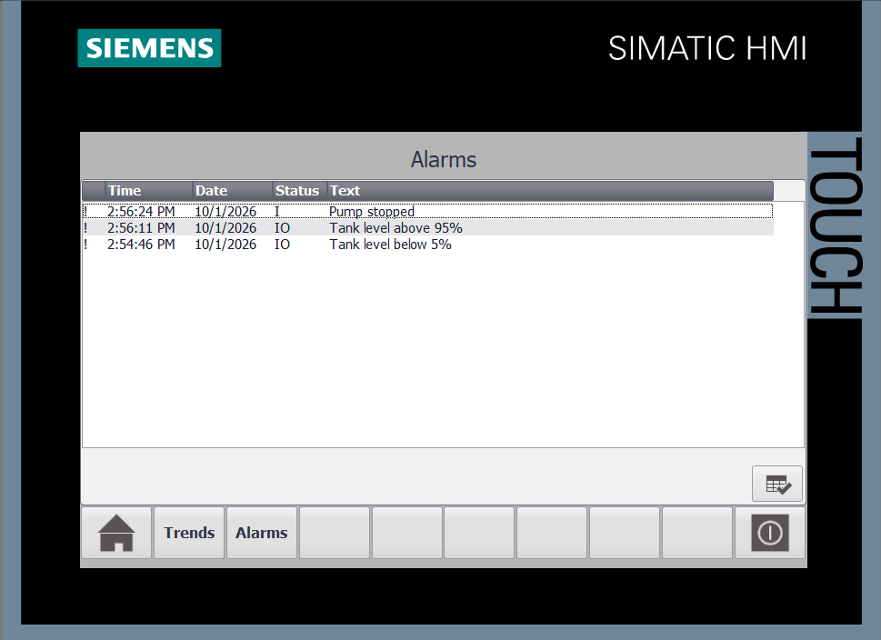
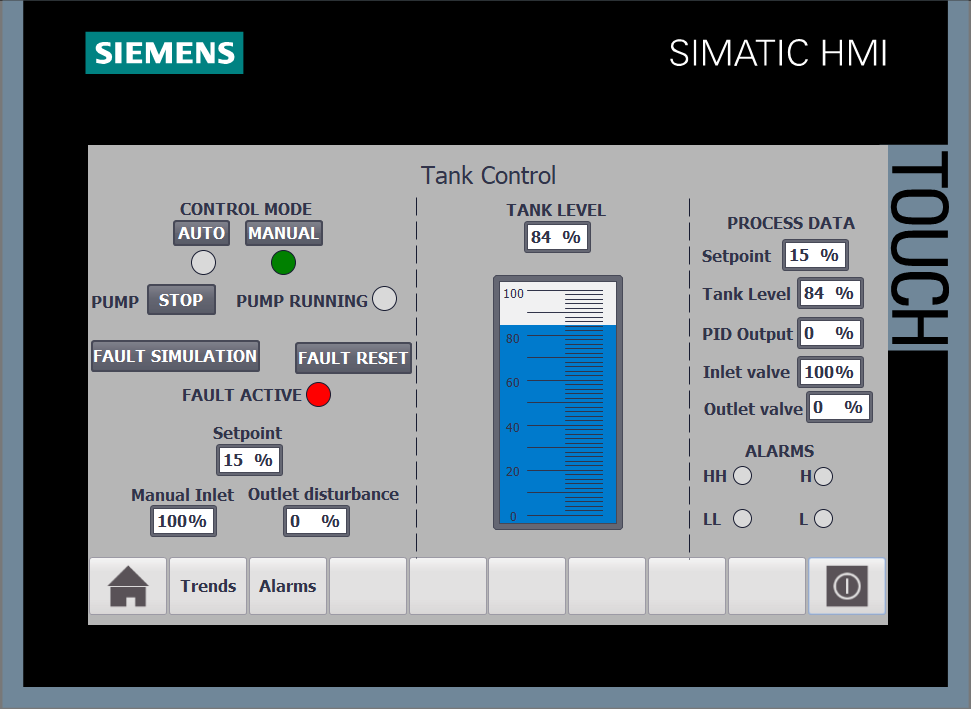

# S7-1200 Tank Level Control

Tank level control system developed in Siemens TIA Portal V17 using an S7-1200 PLC and WinCC HMI.

The project simulates a tank filling and draining process with automatic PID level control, manual operation, alarm handling and pump fault simulation.

## Features

- Automatic tank level control using PID Compact
- Manual and automatic operating modes
- Adjustable tank level setpoint
- Simulated inlet and outlet valves
- Simulated pump operation
- Pump start/stop control in manual mode
- Pump fault simulation and reset
- High and low level protection
- HMI alarm system
- Real-time process trends
- Simulated outlet disturbance
- Tank process simulation executed in a cyclic organization block

## Control System

The process consists of a simulated tank, inlet valve, outlet valve and pump.

In AUTO mode, the PID controller regulates the inlet valve position to maintain the selected tank level setpoint.

In MANUAL mode, the operator can manually control the inlet valve and pump.

The outlet valve can be used to introduce a process disturbance and observe the controller response.

Level protection is implemented using four thresholds:

- High High (HH): 95%
- High (H): 90%
- Low (L): 10%
- Low Low (LL): 5%

HH and LL conditions activate protective control actions to prevent the tank level from exceeding the operating limits.

## Pump Fault Simulation

The project includes a pump fault simulation.

A pump failure can be activated from the HMI. When a fault occurs, the pump stops and a corresponding alarm is generated.

The fault can be reset after the failure simulation has been removed.

## HMI

The WinCC HMI provides:

- AUTO / MANUAL mode selection
- Tank level visualization
- Setpoint adjustment
- PID output monitoring
- Inlet and outlet valve monitoring
- Manual inlet valve control
- Pump START / STOP control
- Pump running indication
- Pump fault simulation and reset
- Level alarm indication
- Real-time process trends
- Alarm history and status display

## PID Control

The PID controller uses:

- Setpoint: desired tank level
- Process value: simulated tank level
- Controller output: inlet valve command

The screenshots below show the response of the control system and stabilization of the tank level after a setpoint change.

### Automatic Control



### PID Response



### Level Control Response



### Approaching Setpoint



### Stabilized Level



## Alarm System

The HMI provides warning and critical level alarms as well as pump fault indication.

### High Level Alarm



### Low Level Alarm



### Pump Fault



### Manual Mode and Pump Fault



## Project Structure

```text
S7-1200-Tank-Level-Control/
├── Documentation/
│   └── PLC_Program.pdf
├── Screenshots/
│   ├── 01_HMI_Auto_Control.png
│   ├── 02_HMI_PID_Response.png
│   ├── 03_HMI_Level_Control_Response.png
│   ├── 04_HMI_Level_Control_Approaching_Setpoint.png
│   ├── 05_HMI_Level_Control_Stabilized.png
│   ├── 06_HMI_Level_HH_Alarm.png
│   ├── 07_HMI_Level_LL_Alarm.png
│   ├── 08_HMI_Pump_Fault.png
│   └── 09_HMI_Manual_Mode_Pump_Fault.png
├── TIA_Project/
│   └── S7-1200-Tank-Level-Control.zap17
└── README.md
```

## Software

- Siemens TIA Portal V17
- SIMATIC S7-1200
- PID Compact
- SIMATIC WinCC Runtime Advanced

## PLC

- Siemens S7-1200
- CPU 1212C DC/DC/DC
- Firmware V4.2

## Documentation

The `Documentation` folder contains a PDF export of the PLC program.

The complete archived TIA Portal V17 project is available in the `TIA_Project` folder.
